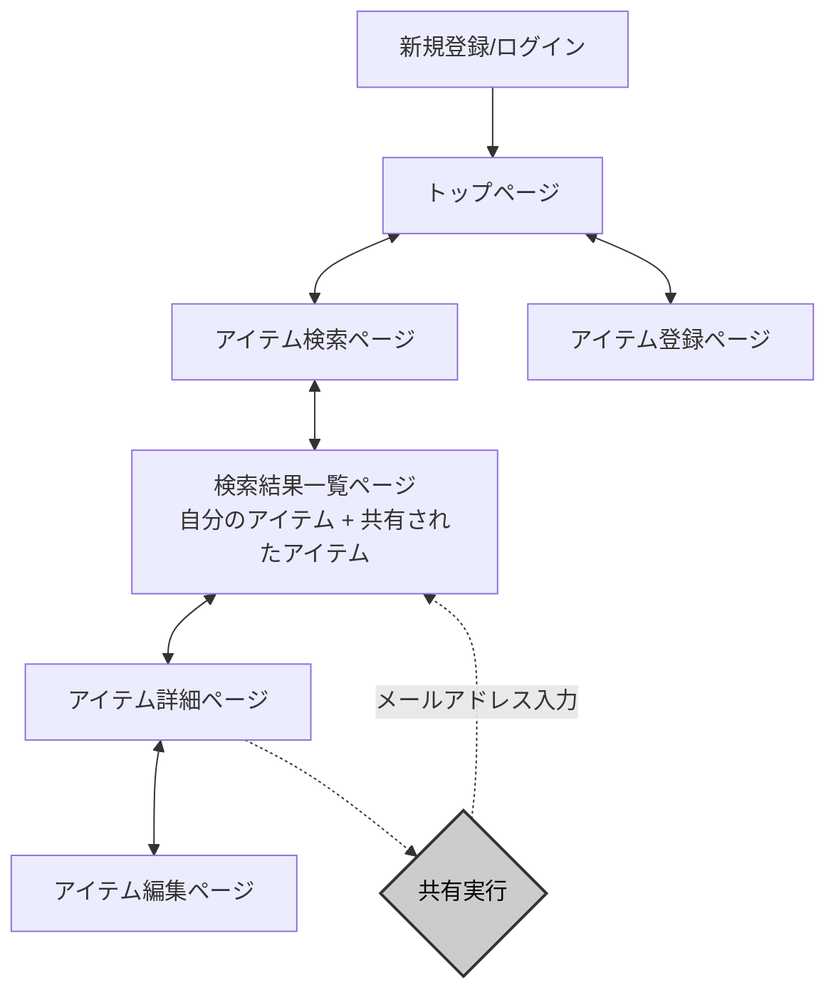
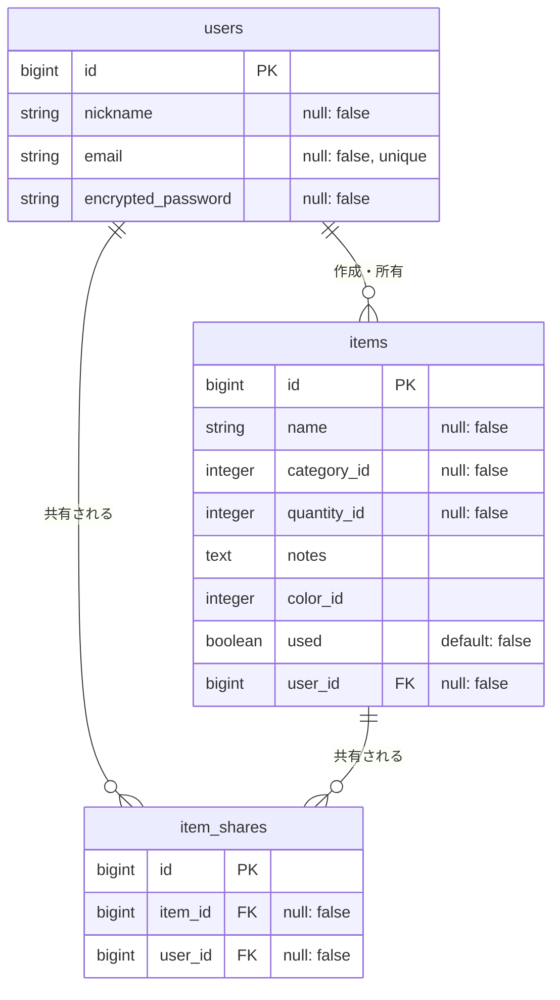

# アプリケーション名
ナニこれ？

# アプリケーション概要
付属品を、写真で分かりやすく一元管理できるアプリ

# URL

http://18.179.96.132

# テスト用アカウント
アプリの共有機能をスムーズにご確認いただくため、2つのアカウントを用意しています。

| アカウント | メールアドレス | パスワード | 役割 |
| :--- | :--- | :--- | :--- |
| テスト用1 | test1@test.com | test1234 | 共有元（アイテムを持つ側） |
| テスト用2 | test2@test.com | test1234 | 共有先（閲覧する側） |

# 利用方法

## アイテム登録
1. トップページのヘッダーにある《新規登録》ボタンをクリックし、新規登録を行う  
2. トップページの《アイテム登録》ボタンをクリックし、アイテム登録を行う（画像は3枚まで）

https://github.com/user-attachments/assets/cddb5888-9d19-4e2d-a97d-94d80866f5ff

## アイテム検索
1. トップページのフォームから条件を絞り、検索結果を表示する（条件を絞らなければ全アイテムの表示、名前と備考欄はフリーワード検索可能）

【ここに動画：アイテム検索 を貼り付け】

## アイテム編集・削除・使用済み/未使用の切り替え
1. 検索結果のアイテムをクリックすると、そのアイテムの詳細画面に遷移する  
2. アイテム詳細画面には《編集》《削除》《使用済み/未使用》ボタンがあり、《編集》ボタンをクリックするとアイテムの詳細を編集できる  
3. 《削除》ボタンをクリックすると、アイテムを削除できる（削除前にアラート表示が出る）  
4. 《使用済み/未使用》ボタンをクリックすると、そのアイテムの検索結果一覧画面に《使用済み》か《未使用》かどうか表示できる

【ここに動画：アイテム編集・切り替え を貼り付け】

## アイテム共有（ユーザー間共有機能）
1. アイテム詳細画面にある共有用フォームから、共有したい相手のメールアドレス（例：`test2@test.com`）を入力し、共有を実行する
2. 共有されたユーザーでログインすると、そのアイテムが自身の検索結果や一覧にも表示されるようになる
3. Punditにより、共有を受けていない第三者がURLを直接入力してもアクセスできないよう権限管理を行っている

【ここに動画：アイテム共有 を貼り付け】

※ 動作確認の際は、上記「テスト用アカウント」の2つ（AとB）を使い、AからBへ共有を行うことで実際の挙動を確認いただけます。

# 画面遷移図

```mermaid
graph TD
    A[新規登録/ログイン] --> B[トップページ]
    B <--> C[アイテム検索ページ]
    C <--> D[検索結果一覧ページ<br/>自分のアイテム + 共有されたアイテム]
    D <--> E[アイテム詳細ページ]
    E <--> F[アイテム編集ページ]
    B <--> G[アイテム登録ページ]
    
    %% 共有機能の導線
    E -.-> H{共有実行}
    H -.-> |メールアドレス入力| D
    
    style H fill:#ccc,stroke:#333,stroke-width:2px,color:#000
```

# ER図

```mermaid
erDiagram
    users ||--o{ items : "作成・所有"
    users ||--o{ item_shares : "共有される"
    items ||--o{ item_shares : "共有される"

    users {
        bigint id PK
        string nickname "null: false"
        string email "null: false, unique"
        string encrypted_password "null: false"
    }

    items {
        bigint id PK
        string name "null: false"
        integer category_id "null: false"
        integer quantity_id "null: false"
        text notes
        integer color_id
        boolean used "default: false"
        bigint user_id FK "null: false"
    }

    item_shares {
        bigint id PK
        bigint item_id FK "null: false"
        bigint user_id FK "null: false"
    }
```

# テーブル設計

## users テーブル

| Column             | Type   | Options                   |
| ------------------ | ------ | ------------------------- |
| nickname           | string | null: false               |
| email              | string | null: false, unique: true |
| encrypted_password | string | null: false               |

### Association
- has_many :items
- has_many :item_shares
- has_many :shared_items, through: :item_shares, source: :item

## items テーブル

| Column      | Type       | Options                        |
| ----------- | ---------- | ------------------------------ |
| name        | string     | null: false                    |
| category_id | integer    | null: false                    |
| quantity_id | integer    | null: false                    |
| notes       | text       |                                |
| color_id    | integer    |                                |
| used        | boolean    | default: false                 |
| user        | references | null: false, foreign_key: true |

### Association
- belongs_to :user
- has_many :item_shares
- has_many :shared_users, through: :item_shares, source: :user

## item_shares テーブル（中間テーブル）

| Column | Type       | Options                        |
| ------ | ---------- | ------------------------------ |
| item   | references | null: false, foreign_key: true |
| user   | references | null: false, foreign_key: true |

### Association
- belongs_to :item
- belongs_to :user

# アプリケーションを作成した背景
先日、自宅のイスが壊れた際に、付属のネジを探そうとしましたが、思っていた場所に見当たらず、結局家中を探し回る羽目になりました。  
その時、もし付属品を写真で管理できるアプリがあれば、何年も使わずに保管している付属品でもすぐに見つけられるのに、と感じました。  
そこで、このアプリの制作を決意しました。  
ただ写真で保存するだけでなく、フリーワード検索や数量、色など、さまざまな条件で簡単に付属品を探し出せる工夫も取り入れています。

# 実装予定の機能
- 画像のスライドショー
- フォームのポップアップ表示

# 開発環境
- **Backend**: Ruby on Rails (Active Storage, Devise, Pundit)
- **Frontend**: HTML, CSS (Tailwind CSS), JavaScript (Stimulus.js, FontAwesome)
- **Infrastructure**: AWS (EC2) 

# 工夫した点

### 1. 複数画像登録とプレビュー機能
アイテム登録や編集時に写真を最大3枚まで登録でき、さらにプレビュー表示機能を実装しました。  
付属品は長期間保管する場合もあるため、多角的な写真で確認できるようにしています。また、プレビューにより誤登録を防ぎ、利便性を向上させました。

### 2. デバイスを問わない操作性（ドラッグ＆ドロップ）
導入時の大量登録を想定し、PCではドラッグ＆ドロップで、スマホではカメラ起動から簡単に画像を登録できる仕組みを整えました。

### 3. ステータス管理（使用済み／未使用）
アイテムを使い終わっても、将来また必要になる可能性があるため、削除せず「使用済み」としてデータを保持できる切り替えボタンを実装しました。

### 4. セキュアな共有機能（Punditの導入）
特定のユーザーとだけアイテム情報を共有できる機能を実装しました。認可のGem「Pundit」を導入することで、共有設定をしていない他ユーザーがURLを直接入力してもアクセスできないよう制限をかけ、データの安全性を確保しました。
