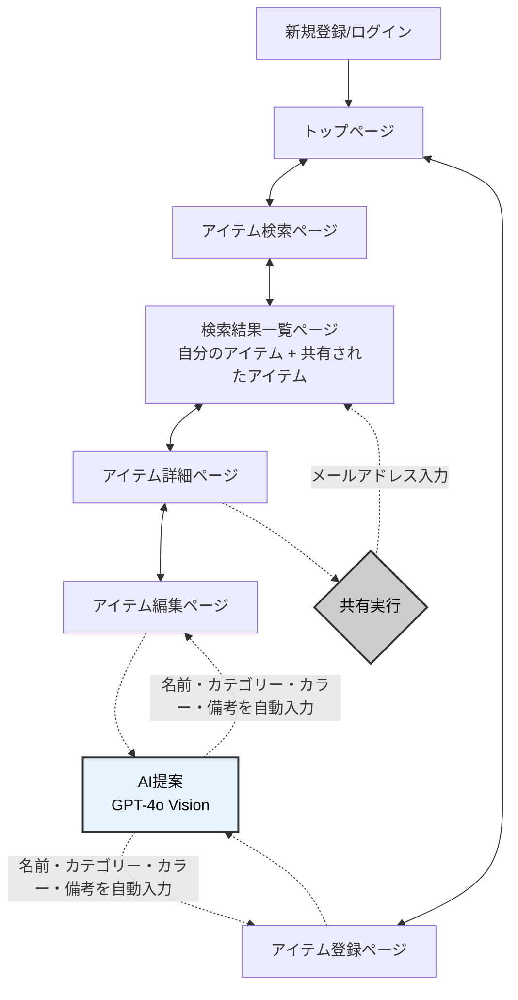
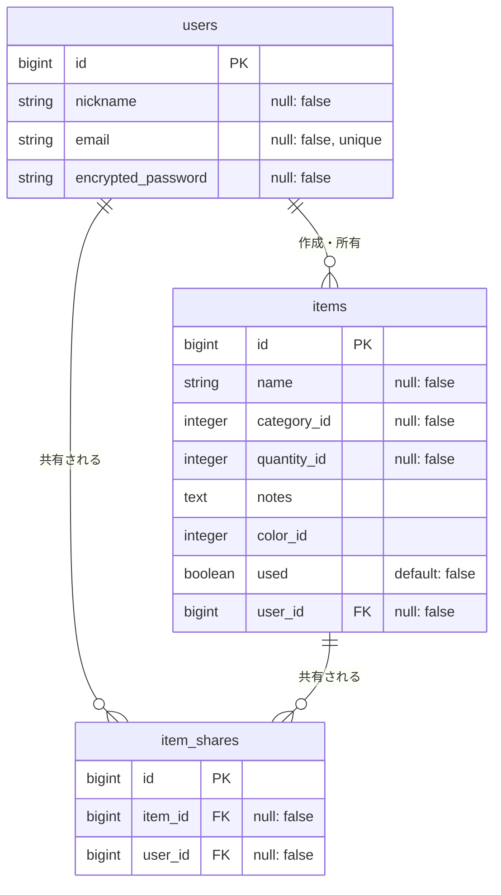

# アプリケーション名
ナニこれ？

# アプリケーション概要
Ruby on Rails / AWS（EC2, S3）/ OpenAI GPT-4o Vision で構築した Web アプリケーションです。

「あの付属品、どこにしまったっけ？」をなくすための管理アプリです。  
家具や家電に付属するネジ・部品を写真で登録し、名前・カテゴリ・色などの条件で素早く検索できます。  
使用済み／未使用のステータス管理や、特定のユーザーとのアイテム共有機能も備えており、長期保管でも迷わず見つけられます。

アイテム登録・編集時には **OpenAI GPT-4o Vision** による AI 提案機能を利用でき、写真から名前・カテゴリー・カラー・備考欄を自動入力できます。

# URL

http://18.179.96.132

※ アクセス時に HTTP Basic 認証（ID・パスワード）の入力が求められます。閲覧希望の方は GitHub の Issues またはリポジトリオーナーへお問い合わせください。

# リポジトリ

https://github.com/urakawakazuo0301/NaniKore

# テスト用アカウント
HTTP Basic 認証を通過した後、Devise によるログインが必要です。  
アプリの共有機能をスムーズにご確認いただくため、2つのアカウントを用意しています。

| アカウント | メールアドレス | パスワード | 役割 |
| :--- | :--- | :--- | :--- |
| テスト用1 | test1@test.com | test1234 | 共有元（アイテムを持つ側） |
| テスト用2 | test2@test.com | test1234 | 共有先（閲覧する側） |

# 利用方法

## アイテム登録
1. トップページのヘッダーにある《新規登録》ボタンをクリックし、新規登録を行う  
2. トップページの《アイテム登録》ボタンをクリックし、アイテム登録を行う（画像は3枚まで）

https://github.com/user-attachments/assets/ff367914-1b08-419b-916d-9a0c8050583e

## AI による入力提案（OpenAI Vision）
1. アイテム登録画面または編集画面で、先に画像を1枚以上アップロードする  
2. 《📷 AIに提案してもらう》ボタンをクリックする  
3. AI が画像を分析し、以下の項目をフォームに自動入力する  
   - **名前**（付属品・部品の名称）  
   - **カテゴリー**（アプリ内のカテゴリーリストから選択）  
   - **カラー**（赤・青・みどり・オレンジ・むらさき・黒・白・グレー から選択）  
   - **備考欄**（画像内の文字・ラベル・型番・メーカー名など）  
4. 自動入力された内容はそのまま登録してもよいし、必要に応じて手動で修正できる

※ API キーはサーバー側（Rails credentials）で管理しており、ブラウザには送信されません。

## アイテム検索
1. トップページのフォームから条件を絞り、検索結果を表示する（条件を絞らなければ全アイテムを表示）
2. 絞り込み可能な条件は以下のとおり  
   - **名前・備考欄**: フリーワード検索（部分一致）  
   - **カテゴリー・数量・カラー**: プルダウン／ラジオボタンから選択  
3. 検索結果一覧では、複数枚登録された画像を Swiper によるスライド表示で確認できる

https://github.com/user-attachments/assets/11464bd0-b5ac-42e2-b82b-2853bc497540

## アイテム編集・削除・使用済み/未使用の切り替え
1. 検索結果のアイテムをクリックすると、そのアイテムの詳細画面に遷移する  
2. アイテム詳細画面には《編集》《削除》《使用済み/未使用》ボタンがあり、《編集》ボタンをクリックするとアイテムの詳細を編集できる  
3. 編集画面でも AI 提案機能（《📷 AIに提案してもらう》）が利用できる  
4. 《削除》ボタンをクリックすると、アイテムを削除できる（削除前にアラート表示が出る）  
5. 《使用済み/未使用》ボタンをクリックすると、そのアイテムの検索結果一覧画面に《使用済み》か《未使用》かどうか表示できる

https://github.com/user-attachments/assets/4812bc13-1ce8-4ff4-88b0-7ff35ebd0da7

https://github.com/user-attachments/assets/cbeb6b66-3721-4a46-be74-8716a4f80dee

https://github.com/user-attachments/assets/6d4e5d07-1f36-46a2-8218-3a5b9710647c

## アイテム共有（ユーザー間共有機能）
1. アイテム詳細画面にある共有用フォームから、共有したい相手のメールアドレス（例：`test2@test.com`）を入力し、共有を実行する
2. 共有されたユーザーでログインすると、そのアイテムが自身の検索結果や一覧にも表示されるようになる
3. Punditにより、共有を受けていない第三者がURLを直接入力してもアクセスできないよう権限管理を行っている

https://github.com/user-attachments/assets/7484557d-66a4-4b43-b711-0e1f67b342d4

https://github.com/user-attachments/assets/85aed34d-d5d0-4088-b9b7-a0ad9a5dc38b

https://github.com/user-attachments/assets/8ee326d9-7104-48dc-aaf4-a1102fa4d923

※ 動作確認の際は、上記「テスト用アカウント」の2つ（AとB）を使い、AからBへ共有を行うことで実際の挙動を確認いただけます。

# 工夫した点

## 1. 複数画像登録とプレビュー機能
アイテム登録や編集時に写真を最大3枚まで登録でき、さらにプレビュー表示機能を実装しました。  
付属品は長期間保管する場合もあるため、多角的な写真で確認できるようにしています。また、プレビューにより誤登録を防ぎ、利便性を向上させました。

## 2. デバイスを問わない操作性（ドラッグ＆ドロップ）
導入時の大量登録を想定し、PCではドラッグ＆ドロップで、スマホではカメラ起動から簡単に画像を登録できる仕組みを整えました。  
画像は Active Storage 経由で AWS S3 に保存されます。

## 3. ステータス管理（使用済み／未使用）
アイテムを使い終わっても、将来また必要になる可能性があるため、削除せず「使用済み」としてデータを保持できる切り替えボタンを実装しました。

## 4. セキュアな共有機能（Punditの導入）
特定のユーザーとだけアイテム情報を共有できる機能を実装しました。認可のGem「Pundit」を導入することで、共有設定をしていない他ユーザーがURLを直接入力してもアクセスできないよう制限をかけ、データの安全性を確保しました。

## 5. AI による入力支援（OpenAI GPT-4o Vision）
アップロードした写真を OpenAI Vision API で分析し、名前・カテゴリー・カラー・備考欄を JSON 形式で取得してフォームに反映する機能を実装しました。

- **サーバー側処理**: API キーは `Rails.application.credentials` で暗号化保管し、コントローラーからのみ OpenAI API を呼び出す  
- **アプリ内データとの連携**: AI が返したカテゴリー名・カラー名を ActiveHash の ID に変換してからフロントエンドへ返却  
- **登録・編集の両方に対応**: 新規登録画面・編集画面のどちらでも AI 提案ボタンを利用可能  
- **入力の手間削減**: 型番やラベル文字の読み取りを備考欄に自動入力し、付属品登録の効率を向上

## 6. 未使用画像の定期削除
画像アップロード後に登録を完了しなかった場合に S3 上に残る孤立ファイルを、whenever + cron により1日1回自動削除する Rake タスクを設定しました。

# 画面遷移図

```mermaid
graph TD
    A[新規登録/ログイン] --> B[トップページ]
    B <--> C[アイテム検索ページ]
    C <--> D[検索結果一覧ページ<br/>自分のアイテム + 共有されたアイテム]
    D <--> E[アイテム詳細ページ]
    E <--> F[アイテム編集ページ]
    B <--> G[アイテム登録ページ]
    
    %% AI提案機能
    G -.-> I[AI提案<br/>GPT-4o Vision]
    F -.-> I
    I -.-> |名前・カテゴリー・カラー・備考を自動入力| G
    I -.-> |名前・カテゴリー・カラー・備考を自動入力| F
    
    %% 共有機能の導線
    E -.-> H{共有実行}
    H -.-> |メールアドレス入力| D
    
    style H fill:#ccc,stroke:#333,stroke-width:2px,color:#000
    style I fill:#e8f4fd,stroke:#333,stroke-width:2px,color:#000
```

# ER図

```mermaid
erDiagram
    users ||--o{ items : "作成・所有"
    users ||--o{ item_shares : "共有される"
    items ||--o{ item_shares : "共有される"

    users {
        bigint id PK
        string nickname "null: false"
        string email "null: false, unique"
        string encrypted_password "null: false"
    }

    items {
        bigint id PK
        string name "null: false"
        integer category_id "null: false"
        integer quantity_id "null: false"
        text notes
        integer color_id
        boolean used "default: false"
        bigint user_id FK "null: false"
    }

    item_shares {
        bigint id PK
        bigint item_id FK "null: false"
        bigint user_id FK "null: false"
    }
```

# テーブル設計

## users テーブル

| Column             | Type   | Options                   |
| ------------------ | ------ | ------------------------- |
| nickname           | string | null: false               |
| email              | string | null: false, unique: true |
| encrypted_password | string | null: false               |

### Association
- has_many :items
- has_many :item_shares
- has_many :shared_items, through: :item_shares, source: :item

## items テーブル

| Column      | Type       | Options                        |
| ----------- | ---------- | ------------------------------ |
| name        | string     | null: false                    |
| category_id | integer    | null: false                    |
| quantity_id | integer    | null: false                    |
| notes       | text       |                                |
| color_id    | integer    |                                |
| used        | boolean    | default: false                 |
| user        | references | null: false, foreign_key: true |

### Association
- belongs_to :user
- has_many :item_shares
- has_many :shared_users, through: :item_shares, source: :user

## item_shares テーブル（中間テーブル）

| Column | Type       | Options                        |
| ------ | ---------- | ------------------------------ |
| item   | references | null: false, foreign_key: true |
| user   | references | null: false, foreign_key: true |

### Association
- belongs_to :item
- belongs_to :user

# アプリケーションを作成した背景
先日、自宅のイスが壊れた際に、付属のネジを探そうとしましたが、思っていた場所に見当たらず、結局家中を探し回る羽目になりました。  
その時、もし付属品を写真で管理できるアプリがあれば、何年も使わずに保管している付属品でもすぐに見つけられるのに、と感じました。  
そこで、このアプリの制作を決意しました。  

# 開発環境
- **Backend**: Ruby 3.2.0 / Ruby on Rails 7.0
- **Database**: MySQL（本番）
- **Authentication / Authorization**: Devise, Pundit
- **File Storage**: Active Storage + AWS S3（本番）
- **AI**: OpenAI API（GPT-4o Vision / ruby-openai gem）
- **Frontend**: HTML, CSS（Tailwind CSS）, JavaScript（Stimulus.js, FontAwesome）
- **Infrastructure**: AWS EC2, Capistrano, Unicorn
- **Other**: ActiveHash, whenever（cron）, RSpec

# 実装予定の機能
- アイテム詳細画面での画像スライドショー（検索結果一覧では Swiper によるスライド表示を実装済み）
- フォームのポップアップ表示
