# アプリケーション名
ナニこれ？

# アプリケーション概要
付属品を、写真で分かりやすく一元管理できるアプリ

# 画面遷移図

# URL

# テスト用アカウント

# ER図

# テーブル設計

## users テーブル

| Column             | Type   | Options     |
| ------------------ | ------ | ----------- |
| nickname           | string | null: false |
| email              | string | null: false, unique: true |
| encrypted_password | string | null: false |

### Association

 - has_many :items

## items テーブル

| Column            | Type       | Options     |
| ----------        | ---------- | ----------- |
| name              | string     | null: false |
| category_id       | integer    | null: false |
| quantity_id       | integer    | null: false |
| notes             | text       |             |
| color_id          | integer    |             |
| user              | references | null: false, foreign_key: true |

### Association

 - belongs_to :user